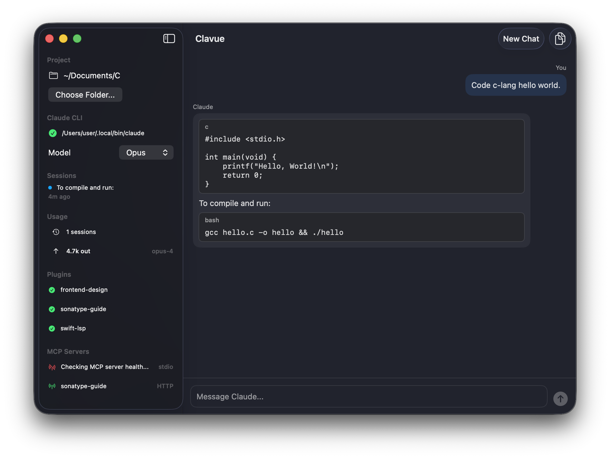

# Clavue

Native macOS GUI for [Claude Code](https://docs.anthropic.com/en/docs/claude-code).



## Features

- Chat with Claude directly from a native SwiftUI interface
- Session history — browse and resume past conversations
- Markdown rendering with syntax-highlighted code blocks
- Model picker (Opus / Sonnet / Haiku)
- Touched-files panel showing what Claude modified
- Command palette for quick actions

## Requirements

- macOS 14+
- Claude Code CLI installed (`claude` binary in PATH or `~/.claude/local/`)

## Getting Started

1. Open `Clavue.xcodeproj` in Xcode
2. Build & Run (Cmd+R)
3. Select a project folder from the sidebar
4. Start chatting

## Architecture

```
Clavue/
├── App/          # App entry point
├── Models/       # Data models (messages, sessions, events)
├── Views/        # SwiftUI views
├── Services/     # Claude CLI integration, session & config I/O
└── Utilities/    # Formatters and helpers
```

## License

MIT
